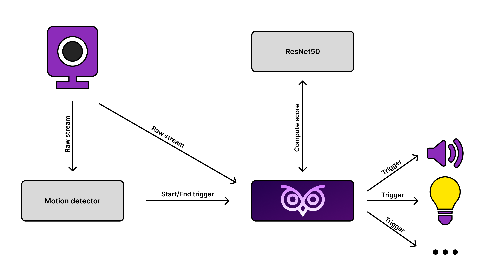

# NightOwl
A deep learning model for sleep-walking detection made in pytorch.

<br />
<div align="center">
  
</div>


## Idea
The idea is to detect sleep-walking episodes using camera placed in the bedroom. When a sleep-walking episode is detected, multiple things can be done, such as turning on the lights, playing a sound, or make a strong vibration on the smartwatch, to wake up the person.

## How it works
The camera is continuosly watched by an external motion detector (e.g. Blue Iris). When a movement is detected, a trigger is sent to the [NightOwl manager](https://github.com/francesco-re-1107/NightOwl-manager). The manager then starts pulling frames from the camera and analyzes them using a deep learning model. The model compute a score for each frame, and if the moving average of the score is above a threshold, the system is triggered.
<br />
<div align="center">
  
</div>

## Model
The CNN used is a ResNet50 with custom fully connected layer.
In particular, the last layer of the ResNet50 is replaced with a Sequential layer as follows:
```python
Linear(2048, 256)
ReLU()
Dropout(0.4)
Linear(256, 3)
LogSoftmax(dim=1)
```

## Dataset
The dataset was created and labelled by me, so for privacy reasons it is not in this repository. It is composed of 3 classes:
- `sleeping`: the person is sleeping
- `awake`: the person is awake but in his bed
- `danger`: the person is out of bed

## Results
The results obtained are very good, the accuracy of the overall system is pretty much around 100%. Additionally, the model is able to act in less than 3 seconds (2 seconds camera delay + 1 second model delay).